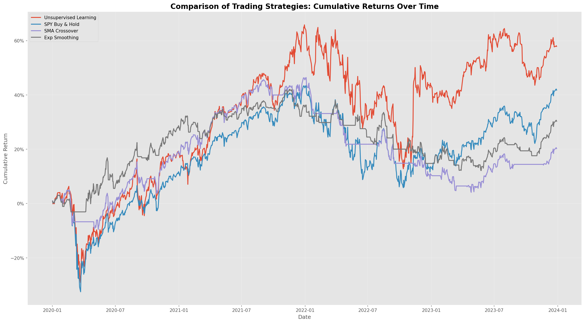

# Momentum-Clustered Algorithmic Trading Strategy

I built this project to learn how machine learning can be applied to stock trading. The idea is to pick high-momentum stocks each month using K-Means clustering, then figure out how much to invest in each one using portfolio optimization. I wanted to see if this could beat just holding the S&P 500... and it did.

## What it does

Each month the strategy runs through a few steps:

1. Pulls all S&P 500 stocks and filters down to the top 150 most liquid ones (based on average dollar volume over 5 years).
2. Calculates a bunch of technical indicators for each stock: RSI, Bollinger Bands, ATR, MACD, Garman-Klass volatility, and momentum returns over 1, 2, 3, 6, 9, and 12 months.
3. Adds Fama-French factor betas (5 factors, 24-month rolling window) to capture each stock's systematic risk exposure.
4. Runs K-Means clustering to group stocks into 4 clusters. The clusters are seeded at RSI values of 40, 55, 65, and 80 so we get consistent results month to month.
5. Picks stocks in the highest RSI cluster (cluster 3, RSI ≈ 80) as these are the stocks with the most upward momentum.
6. Optimizes portfolio weights using Efficient Frontier to maximize Sharpe ratio. Each stock is capped at 10% of the portfolio.
7. Calculates daily returns based on those weights.

The hypothesis is simple: stocks with high RSI tend to keep going up in the short term. So the strategy rides that momentum every month and rebalances when it changes.

## Project Structure

```
momentum-clustered-algorithmic-trading-strategy/
│
├── main.py                        # runs everything
├── requirements.txt
│
├── src/
│   ├── smoke_test.py              # quick pipeline check (30 stocks, 6 years, no LSTM)
│   │
│   ├── data/
│   │   └── fetcher.py             # downloads S&P 500 data, SPY, and Fama-French factors
│   │
│   ├── features/
│   │   └── indicators.py          # computes all the technical indicators and rolling betas
│   │
│   ├── models/
│   │   ├── clustering.py          # K-Means clustering with RSI-anchored centroids
│   │   ├── portfolio.py           # Efficient Frontier optimization
│   │   └── lstm_model.py          # PyTorch LSTM for price direction prediction
│   │
│   ├── strategies/
│   │   ├── sma_strategy.py        # 20/50-day moving average crossover
│   │   └── exp_smoothing_strategy.py  # 20-day EMA strategy
│   │
│   ├── backtest/
│   │   └── engine.py              # the main backtest loop
│   │
│   └── visualization/
│       └── plots.py               # all the charts and metrics
│
└── final_output/
    ├── cluster_visualization.png  # RSI vs ATR scatter plots across 5 sample months
    ├── unsupervised_strategy.png  # our strategy vs SPY
    ├── strategy_comparison.png    # all 5 strategies side by side
    └── performance_metrics.csv   # full metrics table
```

## The Technical Stuff

### Garman-Klass Volatility
This is a better way to estimate volatility than just looking at daily close prices. It uses the open, high, low, and close to get a more accurate picture of how much a stock moved intraday.

$$\sigma^2_{GK} = \frac{1}{2}\left(\ln\frac{H}{L}\right)^2 - (2\ln 2 - 1)\left(\ln\frac{C}{O}\right)^2$$

### RSI-Anchored K-Means
The problem with regular K-Means is it uses random initialization, so the cluster labels change every month. I fixed this by seeding the centroids at RSI values of 40, 55, 65, and 80. That way cluster 3 always means "high momentum" and the strategy is consistent. You can see the cluster distributions in `final_output/cluster_visualization.png`.

### Fama-French Rolling Betas
For each stock I run a rolling 24-month OLS regression against the 5 Fama-French factors (market risk, size, value, profitability, investment). These betas get shifted forward one month so we're not leaking future data into the model.

### Portfolio Optimization
Once we have the cluster 3 stocks, we use the last 12 months of price data to find the weights that maximize the Sharpe ratio. Each stock is bounded between `1/(2N)` and `10%`. If the optimizer fails we fall back to equal weight.

### LSTM
There's also an LSTM model that retrains every 21 trading days on a rolling 1-year window. It predicts the next day's price direction for SPY and goes long when it expects an increase. It's mostly there as a comparison benchmark.

## Results

These numbers are from a 20-year backtest on the full S&P 500 universe (top 150 by liquidity). All output files get saved to `final_output/`.

| Metric | Unsupervised (ours) | SPY Buy & Hold | SMA Crossover | Exp Smoothing |
|--------|-------------------|----------------|---------------|---------------|
| Total Return | **57.89%** | 41.76% | 20.21% | 30.29% |
| Annualized Return | **12.12%** | 9.13% | 4.72% | 6.85% |
| Sharpe Ratio | **0.55** | 0.50 | 0.34 | 0.52 |
| Max Drawdown | **-33.42%** | -35.75% | -29.66% | -22.08% |
| Win Rate | **53.78%** | 53.78% | 37.28% | 36.38% |
| Best Month | **+23.72%** | +11.95% | +10.33% | +9.23% |
| Worst Month | -13.23% | -13.34% | -9.47% | -6.57% |
| Calmar Ratio | **0.36** | 0.26 | 0.16 | 0.31 |

The K-Means momentum strategy returned 57.89% total vs SPY's 41.76%, an outperformance of about 16 percentage points. Annualized that's 12.12% vs 9.13%. The Sharpe ratio came in at 0.55 vs 0.50, so we're getting more return per unit of risk. Interestingly the max drawdown was slightly better than SPY at -33.42% vs -35.75%, which I didn't expect given we're holding a concentrated momentum portfolio.

`final_output/unsupervised_strategy.png` shows the cumulative return of the strategy vs SPY over the full period. `final_output/strategy_comparison.png` puts all five strategies on the same chart so you can see how they diverge over time.



## Installation

```bash
pip install -r requirements.txt
```

PyTorch install can vary depending on your machine. Check [pytorch.org](https://pytorch.org) if you run into issues.

## How to run it

```bash
python main.py
```

Fair warning, the full run takes around 1 to 2 hours. Most of that is the LSTM retraining every month over 20 years of data. If you just want to test the pipeline quickly, run the smoke test instead from the project root:

```bash
python src/smoke_test.py
```

That cuts it down to 30 stocks and 6 years with no LSTM so it finishes in a few minutes.

## What we're comparing against

| Strategy | Description |
|----------|-------------|
| **Unsupervised Learning** | our K-Means momentum strategy |
| **SPY Buy & Hold** | just hold SPY, the passive benchmark |
| **SMA Crossover** | buy when the 20-day MA crosses above the 50-day MA |
| **Exp Smoothing** | buy when SPY price is above its 20-day EMA |
| **LSTM** | buy when the LSTM predicts the next day will be higher |

## License

MIT
